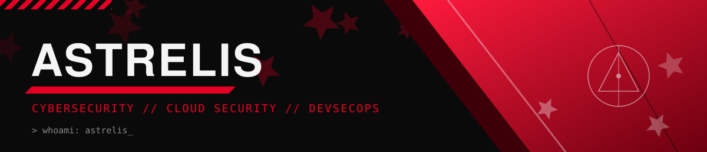
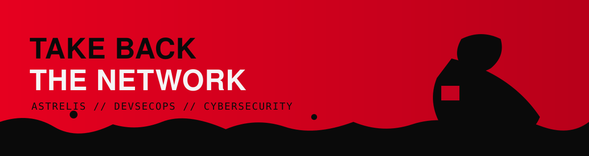

  

  
  
  

---

### 🖤 Who Am I

I'm an 11th-grade student building toward a career in **Cybersecurity, Cloud Security, and DevSecOps**. My focus is split across three lanes: securing cloud infrastructure, hardening systems from the ground up, and building clean, functional websites. I work daily in Linux, and I'm sharpening my offensive-security chops alongside solid software fundamentals in **Python** and **Go**.

- 🔐 Focused on: Cloud Security, DevSecOps pipelines, and offensive security fundamentals
- 🌐 Also building: web applications and interfaces from scratch
- 🌱 Currently learning: Go, container security, AWS security practices
- 🎯 Goal: land a DevSecOps role — Linux → Cloud → CI/CD → Security, fully integrated

---

### 🔗 Connect with Me

---

### 🛠️ Tech Stack

**Systems**

**Security & DevSecOps**

---

### 📊 GitHub Analytics

  
  

  

---

  

---

### 🕹️ Contribution Graph — Arcade Mode

<picture>
  <source media="(prefers-color-scheme: dark)" srcset="https://raw.githubusercontent.com/Astrel-is/Astrel-is/output/pacman-contribution-graph-dark.svg">
  
</picture>

<em>Auto-updates daily via GitHub Actions — see setup note below if these are blank.</em>

---

### 📌 Pinned Focus Areas

| Project | Stack | Status |
|---|---|---|
| Kali/Pentest Toolkit | Kali,Cloud security,Devsecops, Bash | 🔧 In progress |
| DevSecOps Learning Track | Docker, K8s, AWS, CI/CD | 🌱 Ongoing |
| Cloud Security Notes & Labs | AWS, Terraform, OWASP | 🌱 Ongoing |

---

  

<em>Code is never finished, it only gets patched. 🖤</em>

